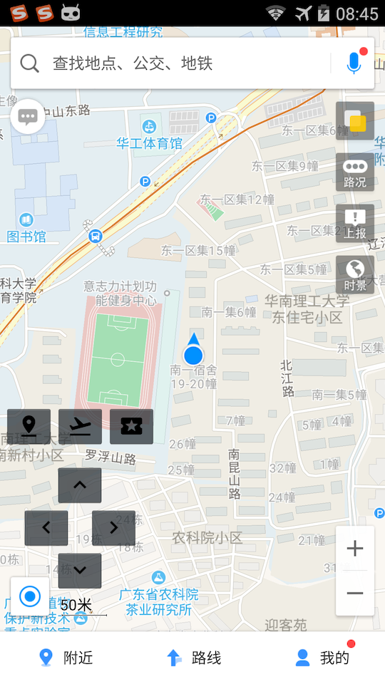

#FakeGPS

FakeGPS是一个GPS设备模拟器，能够根据给定的坐标，输出GPS定位信号，并且带有全局悬浮窗的手柄，通过手柄上的方向按键，能够模拟用户在地图上行走。

借助FakeGPS，在玩Pokemon Go的时候，实现坐在室内却可以让游戏认为你在美国街头游走的效果。（FakeGPS之所以能够诞生，就是因为Pokemon Go (*@ο@*) ）

FakeGPS is a GPS device simulator, GPS location signal keep output according to the coordinates. By the direction keys on the joystick, the user can simulate walking on the map. With the help of FakeGPS, playing Pokemon Go game will be more easier.

按照惯例，先放两张图。

#功能描述
- 模拟真实的GPS设备，每秒输出GPS定位信号。
- 具备两种运行模式：跳变模式和飞行模式。
-> **跳变模式**：直接跳转到新的位置。
->**飞行模式**：根据给定的时间，以线性插值的方式慢慢飞行到新的位置。

- 带有全局浮窗手柄，点击手柄上的方向按键会在当前位置上做一定的偏移（通过Move Step设置，单位为度数）。手柄单击一次移动一格，长按会连续移动。

#安装说明
由于模拟位置需要借助系统的`ACCESS_MOCK_LOCATION`权限，因此FakeGPS 需要以system的权限，安装到system分区中。

1、Root手机，获取system分区的读写权限
2、借助[Lucky Patcher](https://lucky-patcher.netbew.com/) 把FakeGPS以系统应用的方式安装
3、打开Android系统设置开发者选项，取消“允许模拟位置”勾选。设置位置服务仅使用GPS设备。
4、打开FakeGPS，点击Start，这个时候手柄会展示出来，如果没有弹出，请打开应用的悬浮窗显示权限（特别是MIUI和Flyme，权限默认是关闭的），然后打开地图应用（谷歌地图和高德地图测试可用）。查看是否能够定位到设置的坐标，点击手柄上的按键检查是否能够正常移动。

#最后
时间比较匆忙，应用的体验还不是细致，有空再来完善。
欢迎各位同学发pull request来帮忙改进，谢谢大家。

